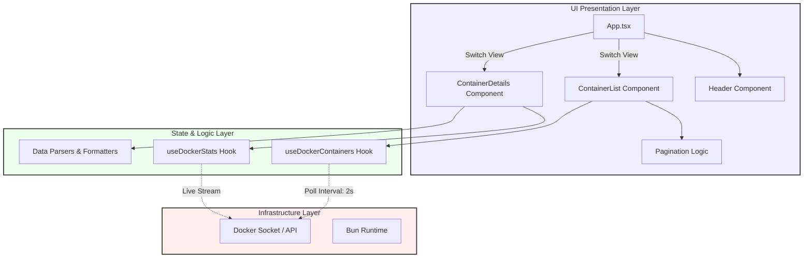
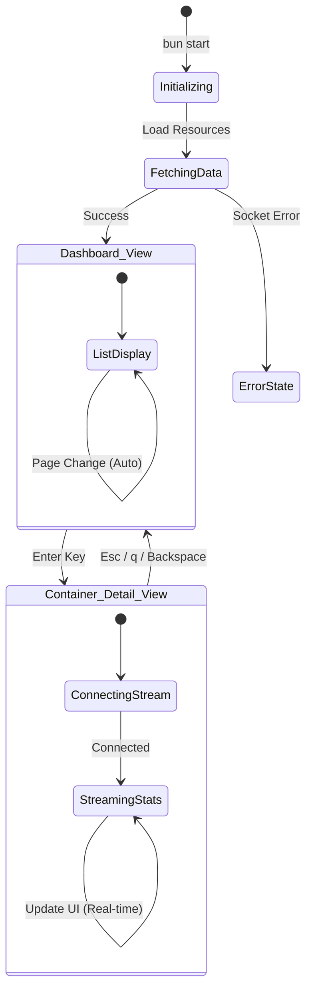
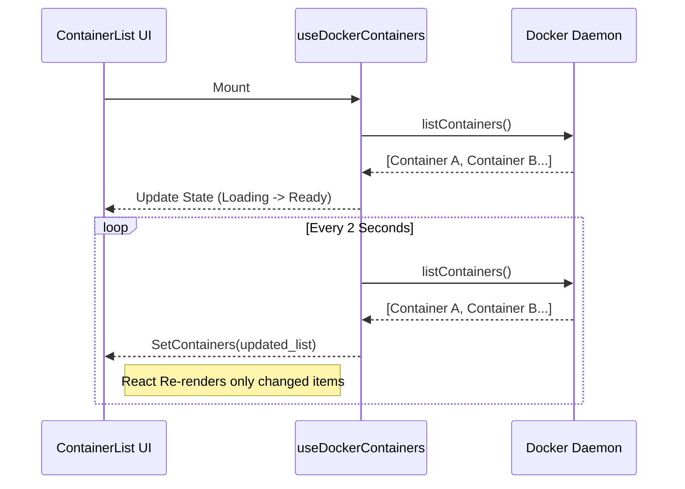

# Docker TUI

A stunning, modern Terminal User Interface for monitoring and managing Docker containers, built with **Bun**, **React**, and **Ink**.


## 🌟 Features

- **Visual Appeal**: Beautiful gradients and big text headers using `ink-gradient` and `ink-big-text`.
- **Live Monitoring**: Real-time streaming of CPU, Memory, and Network I/O using Docker streams.
- **Keyboard Navigation**: Intuitive Up/Down arrow navigation and Vim-style keys support.
- **Smart Pagination**: Automatically paginates long lists of containers (10 per page), preventing terminal scroll jumping.
- **Instant Feedback**: Live status indicators (Running/Exited) with color-coded feedback.
- **Performance**: Built on Bun for ultra-fast startup and execution.

---

## 🏗️ Architecture & Diagrams

### Component Map

This high-level overview illustrates how the application state flows from the Docker socket into the React components.



### User Interaction Flow

The following state diagram details the user experience and navigation paths.



### Data Refresh Cycle

How the application keeps data fresh without overwhelming the system.



---

## 🎮 Key Bindings

| Key                | Context     | Action                             |
| :----------------- | :---------- | :--------------------------------- |
| `↑` / `Up Arrow`   | List View   | Move selection up                  |
| `↓` / `Down Arrow` | List View   | Move selection down                |
| `Enter` / `Return` | List View   | View details of selected container |
| `Esc`              | Detail View | Return to List View                |
| `q`                | Detail View | Return to List View                |
| `Backspace`        | Detail View | Return to List View                |
| `Ctrl+C`           | Global      | Exit Application                   |

---

## 📂 Project Structure

```bash
docker-tui/
├── src/
│   ├── components/
│   │   ├── Header.tsx          # App logo and title
│   │   ├── ContainerList.tsx   # Paginated list of containers
│   │   └── ContainerDetails.tsx # Live stats view
│   ├── hooks/
│   │   ├── useDockerContainers.ts # Polling logic for container list
│   │   └── useDockerStats.ts      # Streaming logic for stats
│   ├── index.tsx               # Entry point
│   └── App.tsx                 # Main layout & router
├── package.json
├── tsconfig.json
└── README.md
```

---

## 🚀 Getting Started

### Prerequisites

- **Bun**: v1.0 or higher
- **Docker**: Docker Daemon must be running

### Installation

```bash
# Clone the repository
git clone https://github.com/yourusername/docker-tui.git

# Enter directory
cd docker-tui

# Install dependencies
bun install
```

### Usage

Run the TUI directly with Bun:

```bash
bun start
```

For development with hot-reload:

```bash
bun run dev
```

---

## 🔧 Troubleshooting

### "connect ENOENT /var/run/docker.sock"

**Cause:** The application cannot find or access the Docker socket.
**Fix:**

1.  Ensure Docker is running (`systemctl status docker` or Check Docker Desktop).
2.  You might need `sudo` permissions:
    ```bash
    sudo bun start
    ```
3.  Or add your user to the docker group (recommended):
    ```bash
    sudo usermod -aG docker $USER
    # Log out and log back in for this to take effect
    ```

### "Permission denied"

**Cause:** Your user does not have read/write access to the docker socket.
**Fix:** Follow step 3 above to add your user to the `docker` group.

---

## 🔮 Future Roadmap

- [ ] **Container Actions**: Start, stop, and restart containers directly from the UI.
- [ ] **Log Viewing**: Stream logs for a specific container in a separate view.
- [ ] **Image Management**: List, pull, and delete Docker images.
- [ ] **Volume Inspector**: View volume mounting details.
- [ ] **Dark/Light Mode**: Toggle color themes.

---

Built with ❤️ by [Your Name] using **Bun**.
