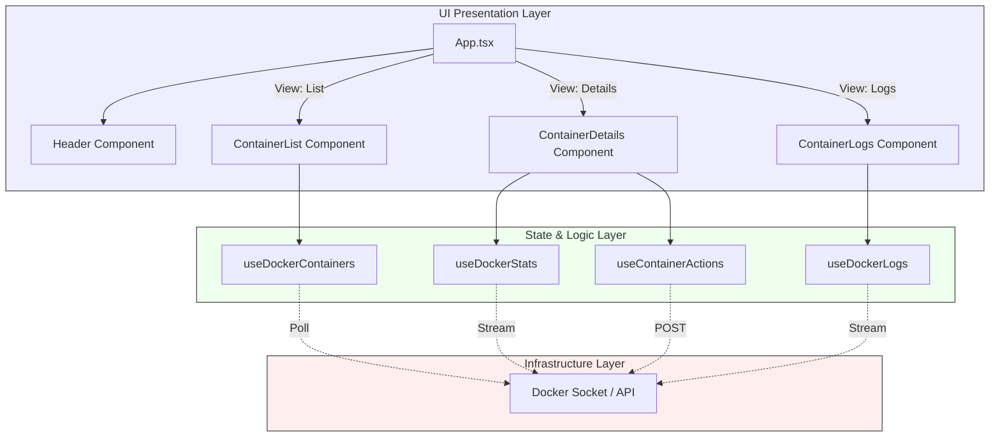
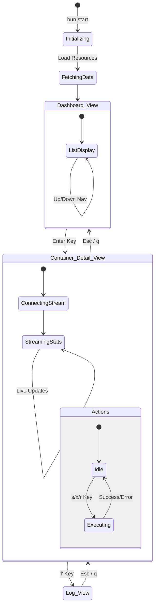

# Docker TUI

A stunning, modern Terminal User Interface for monitoring and managing Docker containers, built with **Bun**, **React**, and **Ink**.


## 🌟 Features

- **Visual Appeal**: Beautiful gradients and big text headers using `ink-gradient` and `ink-big-text`.
- **Live Monitoring**: Real-time streaming of CPU, Memory, and Network I/O using Docker streams.
- **Container Control**: Start, Stop, and Restart containers directly from the UI.
- **Live Logs**: View real-time log streams for any container.
- **Keyboard Navigation**: Intuitive Up/Down arrow navigation and Vim-style keys support.
- **Smart Pagination**: Automatically paginates long lists of containers (10 per page), preventing terminal scroll jumping.
- **Instant Feedback**: Live status indicators (Running/Exited) with color-coded feedback.
- **Performance**: Built on Bun for ultra-fast startup and execution.
- **Portable**: Single-file executables for Linux, Windows, and macOS.

---

## 🏗️ Architecture & Diagrams

### Component Map

This high-level overview illustrates how the application state flows from the Docker socket into the React components, including the new Actions and Logs modules.



### User Interaction Flow

The following state diagram details the user experience and navigation paths, including the new Logs view.



---

## 🎮 Key Bindings

| Key                       | Context         | Action                             |
| :------------------------ | :-------------- | :--------------------------------- |
| `↑` / `Up Arrow`          | List View       | Move selection up                  |
| `↓` / `Down Arrow`        | List View       | Move selection down                |
| `Enter` / `Return`        | List View       | View details of selected container |
| `Esc` / `q` / `Backspace` | Detail/Log View | Go Back / Return to List View      |
| `s`                       | Detail View     | **Start** Container                |
| `x`                       | Detail View     | **Stop** Container                 |
| `r`                       | Detail View     | **Restart** Container              |
| `l`                       | Detail View     | View **Logs**                      |
| `Ctrl+C`                  | Global          | Exit Application                   |

---

## 📂 Project Structure

```bash
docker-tui/
├── bin/                 # Compiled executables
├── src/
│   ├── components/
│   │   ├── Header.tsx           # App logo and title
│   │   ├── ContainerList.tsx    # Paginated list of containers
│   │   ├── ContainerDetails.tsx # Live stats view + Actions
│   │   └── ContainerLogs.tsx    # Log streaming view
│   ├── hooks/
│   │   ├── useDockerContainers.ts # Polling logic for container list
│   │   ├── useDockerStats.ts      # Streaming logic for stats
│   │   ├── useContainerActions.ts # Start/Stop/Restart logic
│   │   └── useDockerLogs.ts       # Log streaming logic
│   ├── index.tsx                # Entry point
│   └── App.tsx                  # Main layout & router
├── package.json
├── tsconfig.json
└── README.md
```

---

## 📦 Building Executables

You can build standalone executables for Linux, Windows, and macOS (Apple Silicon). These binaries do not require Bun or Node.js installed on the target machine.

### Build Commands

```bash
# Build for Linux (output: bin/docker-tui-linux)
bun run build

# Build for Windows (output: bin/docker-tui-windows.exe)
bun run build:win

# Build for macOS Apple Silicon (output: bin/docker-tui-macos-arm64)
bun run build:mac

# Build ALL targets at once
bun run build:all
```

The compiled binaries will be available in the `bin/` directory.

---

## 🚀 Getting Started (Development)

### Prerequisites

- **Bun**: v1.0 or higher
- **Docker**: Docker Daemon must be running

### Installation

```bash
# Clone the repository
git clone https://github.com/yourusername/docker-tui.git

# Enter directory
cd docker-tui

# Install dependencies
bun install
```

### Usage

Run the TUI directly with Bun:

```bash
bun start
```

For development with hot-reload:

```bash
bun run dev
```

---

## 🔧 Troubleshooting

### "connect ENOENT /var/run/docker.sock"

**Cause:** The application cannot find or access the Docker socket.
**Fix:**

1.  Ensure Docker is running (`systemctl status docker` or Check Docker Desktop).
2.  You might need `sudo` permissions, even for the binary:
    ```bash
    sudo ./bin/docker-tui-linux
    ```
3.  Or add your user to the docker group (recommended):
    ```bash
    sudo usermod -aG docker $USER
    # Log out and log back in for this to take effect
    ```

---

## 🔮 Future Roadmap

- [ ] **Image Management**: List, pull, and delete Docker images.
- [ ] **Volume Inspector**: View volume mounting details.
- [ ] **Dark/Light Mode**: Toggle color themes.
- [ ] **Search/Filter**: Filter containers by name.

---

Built with ❤️ by **Rohit** using **Bun**.
